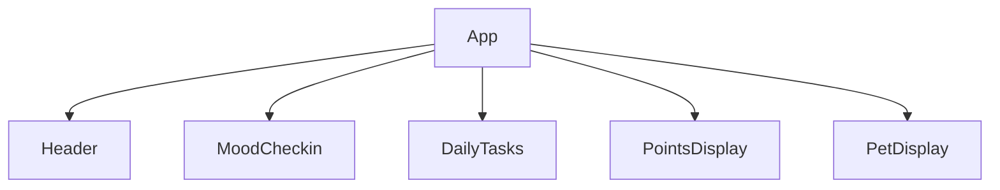

# Design Document: MoodPet

## Overview

MoodPet is a single-page React application built with functional components and React hooks. All state lives in the root `App` component and is passed down as props. No routing, no backend, no persistence beyond the browser session. The UI is styled with inline styles or a single CSS file using soft pastel colors and rounded elements.

## Architecture



All state is managed in `App` via `useState`. Child components are purely presentational — they receive data and callbacks as props.

**State shape in App:**
```js
{
  selectedMood: string | null,   // 'Happy' | 'Neutral' | 'Sad' | 'Stressed' | null
  tasks: [{ id, label, checked }],
  points: number,
}
```

The `activePet` and `nextPetProgress` values are derived from `points` — no extra state needed.

## Components and Interfaces

### `App`
Root component. Owns all state. Computes derived values (`activePet`, `pointsToNext`). Renders all child components.

**Handlers:**
- `handleMoodSelect(mood: string)` — sets `selectedMood`
- `handleTaskToggle(id: string)` — toggles task checked state, adjusts points (+10 / -10)

---

### `Header`
Props: none  
Renders the "MoodPet" title.

---

### `MoodCheckin`
Props: `selectedMood: string | null`, `onMoodSelect: (mood) => void`  
Renders four mood buttons. Highlights the selected one.

---

### `DailyTasks`
Props: `tasks: Task[]`, `onTaskToggle: (id) => void`  
Renders a labeled list of checkboxes.

---

### `PointsDisplay`
Props: `points: number`  
Renders the current points total.

---

### `PetDisplay`
Props: `activePet: Pet`, `pointsToNext: number | null`  
Renders the current pet (emoji + name) and progress toward the next unlock. If all pets are unlocked, shows a completion message.

## Data Models

### Task
```ts
interface Task {
  id: string;
  label: string;
  checked: boolean;
}
```

Initial tasks:
```js
[
  { id: 'water',   label: 'Drink water',               checked: false },
  { id: 'outside', label: 'Go outside for 5 minutes',  checked: false },
  { id: 'friend',  label: 'Text a friend',              checked: false },
]
```

### Pet Tiers
```ts
interface Pet {
  name: string;
  emoji: string;
  threshold: number; // minimum points to unlock
}
```

```js
const PETS: Pet[] = [
  { name: 'Egg',    emoji: '🥚', threshold: 0  },
  { name: 'Chick',  emoji: '🐣', threshold: 10 },
  { name: 'Rabbit', emoji: '🐰', threshold: 20 },
  { name: 'Cat',    emoji: '🐱', threshold: 30 },
];
```

**Derived values (computed in `App`):**
```js
// Active pet = highest tier whose threshold <= points
const activePet = [...PETS].reverse().find(p => points >= p.threshold);

// Next pet = lowest tier whose threshold > points
const nextPet = PETS.find(p => p.threshold > points);
const pointsToNext = nextPet ? nextPet.threshold - points : null;
```

## Correctness Properties

*A property is a characteristic or behavior that should hold true across all valid executions of a system — essentially, a formal statement about what the system should do. Properties serve as the bridge between human-readable specifications and machine-verifiable correctness guarantees.*

---

Property 1: Task toggle adds or removes exactly 10 points
*For any* task list state and any task ID, toggling an unchecked task increases points by exactly 10, and toggling a checked task decreases points by exactly 10.
**Validates: Requirements 4.2, 4.3**

---

Property 2: Points are non-negative
*For any* sequence of task check and uncheck operations, the points total SHALL never fall below 0.
**Validates: Requirements 4.1, 4.3**

---

Property 3: No double-counting
*For any* task, checking it twice in a row (without unchecking) results in the same points total as checking it once.
**Validates: Requirements 4.5**

---

Property 4: Points equal 10 × number of checked tasks
*For any* task list state, the points total SHALL equal exactly 10 multiplied by the count of checked tasks.
**Validates: Requirements 4.2, 4.3**

> Note: Property 1 is subsumed by Property 4 — if points always equal 10 × checked count, then each toggle must add/remove exactly 10. Property 1 is retained for clarity but Property 4 is the canonical invariant.

---

Property 5: Active pet matches highest unlocked tier
*For any* points value, the active pet SHALL be the pet with the highest threshold that is less than or equal to the current points.
**Validates: Requirements 5.3**

---

Property 6: Points-to-next is correct
*For any* points value where a next pet tier exists, `pointsToNext` SHALL equal `nextPet.threshold - points` and SHALL be greater than 0.
**Validates: Requirements 5.5**

---

Property 7: All-unlocked state is correct
*For any* points value greater than or equal to the highest pet threshold, `pointsToNext` SHALL be null (no next pet).
**Validates: Requirements 5.6**

## Error Handling

- No network calls, so no async error states needed.
- Points can only change via task toggles — no direct user input to validate.
- The `activePet` derivation always has a fallback (the 0-threshold Egg), so it will never be undefined.

## Testing Strategy

**Dual approach: unit tests + property-based tests.**

Unit tests (with Vitest + React Testing Library):
- Render smoke tests for each component
- Specific examples: clicking a mood button highlights it, checking a task increments points by 10, unchecking decrements by 10
- Edge cases: all tasks checked (max points), all tasks unchecked (back to 0)

Property-based tests (with fast-check):
- **Property 4**: Generate random sequences of toggle operations, assert `points === 10 * checkedCount` after each operation
- **Property 3**: Generate a random task, check it twice, assert points only increased once
- **Property 5**: Generate random point values (0–100), assert `activePet.threshold <= points` and no higher-threshold pet exists with threshold <= points
- **Property 6 & 7**: Generate random point values, assert `pointsToNext` is correct or null

Each property test runs a minimum of 100 iterations.
Tag format: `Feature: mood-pet, Property {N}: {property_text}`
